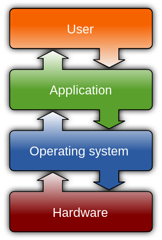

<style>
@import url('https://fonts.googleapis.com/css?family=Patrick+Hand|Patrick+Hand+SC');

section {
    font-family: "Patrick Hand", Verdana;
    font-size: xxx-large;
}

section::after {
  content: 'Slide ' attr(data-marpit-pagination) ' / ' attr(data-marpit-pagination-total);
}

.small {
  font-size: 70%;
}

</style>

# <!-- fit -->les fichiers

<!-- _backgroundImage: url("pexels-mike-1181772.jpg") -->
<!-- _color: #229 -->

---
## on va faire quoi ?

- les fichiers et l'OS
- comment ouvrir, pourquoi fermer ?
- différents formats de fichier
  - pickle (ouille ça pique, c'est du binaire)
  - json (on se sent un peu mieux)
  - csv (ah là on parle)
- parser un nouveau format de fichier

---
# modalités du cours

- on ouvre vs-code
- on participe

---
# <!--fit --> les fichiers et l'OS

<!-- _backgroundImage: url("pexels-pixabay-270572.jpg") -->
<!-- # _color: #eee -->

---
# c'est quoi l'OS ? 


- votre code ne cause jamais directement au harware
- mais au travers d'abstractions
- dont la notion de "fichier"

---
# questions préliminaires

- qu'est-ce qu'un fichier ?
- que contient un fichier ?
- quelles sont les étapes pour y accéder ?

---
# <!-- fit--> Lire un fichier simple

---
# ouverture d'un fichier

```
f = open("hello.txt")
```

- que se passe-t-il ?
- pensez à consulter la documentation
  (comment on la trouve ?)
- que peut-on faire de `f` ?

---
# ouverture d'un fichier (2)

- analyser les types des différents objets
- avancer étape par étape

---
# ouverture d'un fichier (3)

que se passe-t-il si on oublie de fermer le fichier ?

> on va écrire un code qui ouvre `n`  fichiers
> le faire tourner avec `n`= 10, 100, 1000, ...

pouvez-vous prédire ce qui va passer ?

---
# les context managers

l'idiome à **toujours utiliser** pour lire un fichier texte

```python
with open("hello.txt") as f:
    for line in f:
        print(line.strip())
```

ou encore `print(line, end="")`

quelles autres formules connaissiez-vous pour faire ça ?

---
# fichiers binaires

- installez l'extension vsoce *Hex Editor*
- regarder le contenu de `hello.txt` avec vscode
  - utilisez *clic droit* -> *Open With* -> *Hex Editor*
- comparez avec <https://www.rapidtables.com/code/text/ascii-table.html>

---
# fichiers binaires (2)

- pareil avec `tiny.pickle`
- ouvrez-les "normalement"
- que constatez-vous ?

---
# fichiers binaires (3)

- adaptez votre programme de tout à l'heure
- pour lire `tiny.pickle` plutôt que `hello.txt`
- que constatez-vous ?

---
# à retenir

- toujours ouvrir un fichier avec `with`
- un fichier peut
  - contenir du texte (qu'il faut alors décoder)
    pour obtenir un `str`
  - ou pas - on obtient alors des `bytes`

---
# <!-- fit --> les différents <br>formats de fichier

<!-- _backgroundImage: url("pexels-pixabay-162553.jpg") -->
<!-- #_color: yellow -->

---
Tout le monde ne crée pas sa propre structure de fichier !
Il existe des formats ***standard*** qui permettent une interaction entre les programmes et même différents langages de programmation

---
# <!-- fit --> pickle

<!-- _backgroundImage: url("pexels-eva-bronzini-5503189.jpg") -->
<!-- #_color: yellow -->

---
c'est le format *intégré* de Python

- format binaire (s'ouvre avec `open(name, 'rb')`)
- pour sérialiser notamment les *types de base*
- lisez la documentation du module `pickle`
- essayez de lire le fichier `tiny.pickle`
- inspectez les types des objets dans la donnée

---
# écriture

- partez de ce que vous venez de lire
- modifiez certaines des données
- sauvegardez-les dans un nouveau fichier  
  `tiny-changed.pickle`
- et relisez-le pour vérifier que "ça marche"

---
# <!-- fit --> autre format: json

---
## à vous de jouer

- on va refaire pareil à partir de `tiny.json`
- lisez-la doc et écrivez le code qui lit ce fichier
- modifiez la donnée lue, et sauvez-la
- est-ce qu'on peut y mettre un ensemble ?

---
# <!-- fit --> les csv

(les mêmes que ceux qu'on a vus dans le cours pandas)

---
# on recommence

- lisez la documentation du module csv  
  google `python module csv`
- essayez de lire le fichier `pokemon.csv`

---
