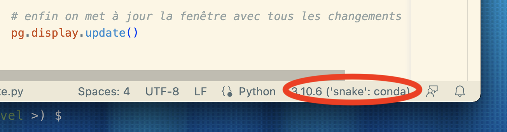
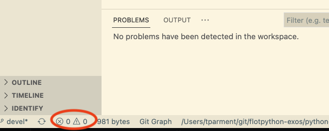
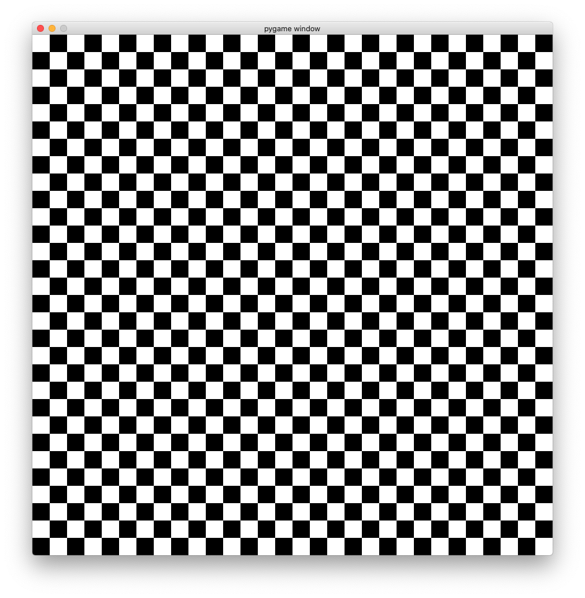
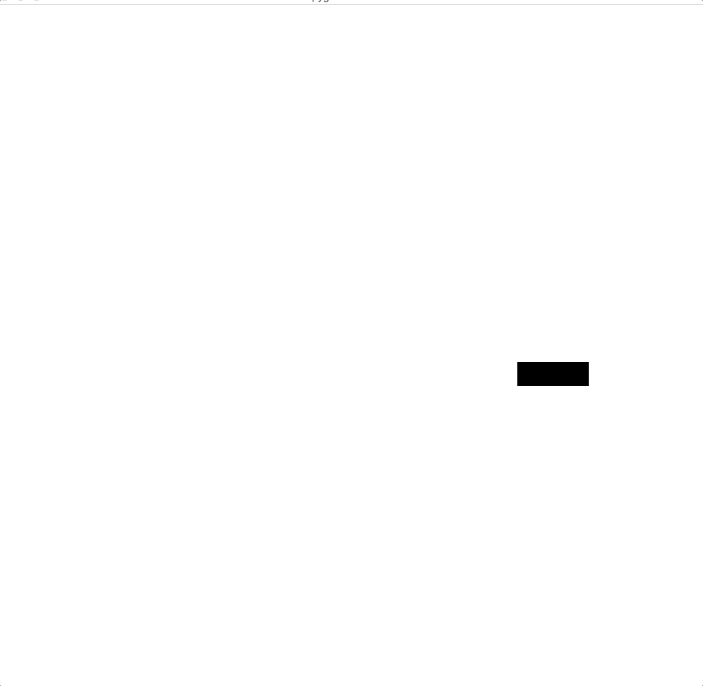

# Le snake

Le but de ce TP est de réaliser un petit jeu en Python. L'objectif est de vous
apprendre à concevoir et réaliser un programme complet, et non de réaliser le
nouveau best-seller.

**avertissement** ce document n'est pas un notebook (et le code ne va pas
marcher dans un notebook non plus); on peut le lire avec jupyter mais c'est
sous-optimal, le mieux est le lire avec vs-code, ou en HTML statique.

## Objectifs et démarche

Gardez en tête que votre objectif est de réaliser un **programme qui marche** et
pas un programme parfait.  
Aussi on va commencer par se créer un dossier vierge, et l'initialiser **comme un
dépôt `git`** (on fait comment déjà ?)

```bash
$ mkdir mycode
$ cd mycode
$ # et là on crée un dépôt git avec ??
```

Et ensuite, on va bien faire attention de **committer chaque fois** qu'on aura
**une version qui marche**  
c'est-à-dire dans ce TP très guidé, **un commit par
étape** en gros !

Et comme ça quand on aura un bug on pourra se concentrer sur **ce qui a changé**
depuis la version qui marchait

Enfin si vous créez votre dépôt à l'intérieur d'un autre dépôt (de cours par
exemple), reportez-vous à la toute dernière section pour comprendre comment `ca
fonctionne.

Mais avant de pouvoir commencer, un peu de préparation...

## On s'installe (optionnel)

_Ce qui suit suppose que vous avez installé Python avec `conda` et que vous avez
un terminal `bash` fonctionnel sur votre ordinateur._

Commencez par créer et activer un environnement dédié au TP:

```bash
# on commence par créer un environnement "snake"
(base) $ conda create -n snake python=3.10
# puis on l'active
(base) $ conda activate snake
# votre terminal doit indiquer le nom d'environnement:
(snake) $
```

**NOTE** si vous ne voyez pas, comme montré ici, le `(snake)` affiché dans le
prompt de bash pour vous rappeler en permanence dans quel environnement on se
trouve, il vous faut taper ceci avant de relancer un terminal

```bash
$ conda init bash
```

Reportez-vous plus bas pour une liste des commandes qui nous permettent de gérer
les environnements virtuels conda.

## Prérequis

Installez ensuite la dernière version du module `pygame` avec `pip`:

```bash
(snake) $ pip install pygame
```

Pour tester votre installation, vous pouvez lancer le programme d'exemple comme suit:

```bash
(snake) $ python -m pygame.examples.aliens
```

soyez patient lors du premier lancement, la librairie initialise des tas de choses...

Sachez aussi que vous pouvez aussi voir la version installée d'une librairie avec

```bash
(snake) pip show snake
```

## Code de démarrage (v0)

Un premier code très simple est le suivant, écrivez-le dans un fichier
`snake.py` et lancez-le avec la commande `python` :

**ATTENTION** il **ne faut PAS** essayer d'exécuter ce code **depuis
un notebook**, ça ne fonctionne pas  
vous allez rencontrer des problèmes mystérieux de kernel qui
meurt, si vous essayez.

```python
# v0 : on repeint l'écran à une période de 1 seconde
# et on a du mal à sortir du programme

# les imports standard en premier
from random import randint

import pygame as pg

# on initialise pygame et on crée une fenêtre de 400x300 pixels
pg.init()
screen = pg.display.set_mode((400, 300))

# on crée aussi un objet "horloge"
clock = pg.time.Clock()

# enfin on boucle à l'infini pour faire le rendu de chaque image
while True:
    # l'objet "clock" permet de limiter le nombre d'images par secondes
    # ici pour cette démo on demande 1 image par seconde
    clock.tick(1)

    # il faut traiter les événements a minima
    # pour que la fenêtre s'affiche
    for event in pg.event.get():
        pass

    # on génère une couleur (Rouge, Vert, Bleu) au hasard
    random_color = (randint(0, 255), randint(0, 255), randint(0, 255))
    # et on colorie l'écran avec cette couleur
    screen.fill(random_color)

    # enfin on met à jour la fenêtre avec tous les changements
    pg.display.update()
```

Vous pouvez désormais exécuter le programme avec:

```bash
(snake) $ python snake.py
```

**Attention** : vous verrez que vous ne pouvez **pas _fermer_ la fenêtre**
normalement, pour quitter votre programme vous devez saisir **CONTROL+C** dans
le terminal.

Nous avons une version qui marchouille; du coup on en fait quoi ?
> un commit bien sûr

## Astuces vs-code

**Astuce #1** : il est **fortement recommandé** d'installer l'extension de
vs-code pour Python

**Astuce #2** : on a créé un environnement virtuel;
du coup il est opportun d'indiquer à vs-code qu'il faut utiliser `snake` -
plutôt que `base`
pour cela cliquer dans la bannière du bas la zone qui indique le Python courant



**Astuce #3** : une fois que c'est fait, pour lancer le programme directement
depuis vs-code :

- ouvrir la palette
  * `⇧ ⌘ P` Shift-Command-P (mac)
  * `⇧ ⌃ P` Shift-Control-P (windows)
- chercher la fonction *Python: Create Terminal*
  - mémoriser le raccourci clavier
  - qui est Control-backtick sur Mac (le backtick c'est `)

**Astuce #4** : si vous voulez avoir en permanence une indication
sur la qualité de votre code, regardez la zone en bas à gauche



## Un petit détail

Il faut savoir que c'est l'appel à `pg.display.update()` qui produit réellement
l'affichage.

En fait, tous les autres calculs se produisent en mémoire (c'est très rapide),
mais à un moment il faut bien parler à la carte vidéo pour l'affichage, et ça
c'est **beaucoup plus lent** (+ieurs centaines de fois plus lent).

Du coup, même si ce `display.update()` reste dans l'ordre de grandeur de la
milliseconde, il faut s'efforcer, pour une bonne fluidité du jeu, de n'appeler
`update()` que le minimum, pour nous ici **une fois par itération de la
boucle** (une fois par frame, quoi)

## Continuons (v1)

Afin d'avoir un comportement plus "normal", nous devons instruire Pygame en lui
disant comment réagir aux clicks sur le clavier ou sur la fenêtre:

```python
# v1 : pareil mais au moins on peut sortir du programme
# avec la touche 'q', ou avec la souris en fermant la fenêtre

from random import randint
import pygame as pg

pg.init()
screen = pg.display.set_mode((400, 300))
clock = pg.time.Clock()

# on rajoute une condition à la boucle: si on la passe à False le programme s'arrête
running = True
while running:

    clock.tick(1)

    random_color = (randint(0, 255), randint(0, 255), randint(0, 255))
    screen.fill(random_color)
    pg.display.update()

    # on itère sur tous les évênements qui ont eu lieu depuis le précédent appel
    # ici donc tous les évènements survenus durant la seconde précédente
    for event in pg.event.get():
        # chaque évênement à un type qui décrit la nature de l'évênement
        # un type de pg.QUIT signifie que l'on a cliqué sur la "croix" de la fenêtre
        if event.type == pg.QUIT:
            running = False
        # un type de pg.KEYDOWN signifie que l'on a appuyé une touche du clavier
        elif event.type == pg.KEYDOWN:
            # si la touche est "Q" on veut quitter le programme
            if event.key == pg.K_q:
                running = False


# Enfin on rajoute un appel à pg.quit()
# Cet appel va permettre à Pygame de "bien s'éteindre" et éviter des bugs sous Windows
pg.quit()
```

et on n'oublie pas de faire un commit...

## Le damier

Nous allons commencer par construire notre plateau de jeu ainsi:

- le plateau de jeu est découpé en 30x30 cases
- chaque case fait 20 pixels de côté

Pour valider le bon fonctionnement de ce plateau de jeu, écrivez un programme
qui dessine un grille (vous pouvez ben sûr choisir d'autres couleurs):



pour cela, vous pouvez utiliser la méthode
[`pg.draw.rect()`](https://www.pygame.org/docs/ref/draw.html#pygame.draw.rect)
qui dessine un rectangle:

```python
# les coordonnées de rectangle que l'on dessine
x = 100 # coordonnée x (colonnes) en pixels
y = 100 # coordonnée y (lignes) en pixels
width = 30 # largeur du rectangle en pixels
height = 30 # hauteur du rectangle en pixels
rect = pg.Rect(x, y, width, height)
# appel à la méthode draw.rect()
color = (255, 0, 0) # couleur rouge
pg.draw.rect(screen, color, rect)
```

une fois que ça marche, vous faites quoi ?

## Un serpent fixe

À partir de maintenant, on va garder le damier comme fond d'écran (même si les
illustrations ne le montrent pas)

L'étape suivante est de dessiner le serpent. Le serpent est simplement une suite
de blocs de couleurs. On veut dessiner le serpent aux coordonnées suivantes:

```python
# les coordonnées du corps du serpent
snake = [
    (10, 15),
    (11, 15),
    (12, 15),
]
```

pour obtenir un schéma comme suit; disons pour fixer les idées que dans ce cas
de figure `(10,15)` est la queue, et `(12, 15)` est la tête (mais c'est
totalement arbitraire et pas du tout imposé) :


## Un serpent qui bouge

Ensuite, nous allons faire bouger le serpent.
C'est en fait très simple:
- nous créons un vecteur de "direction"
  ```python
  direction = (1, 0)
  ```
- à chaque itération de la boucle, nous pouvons déplacer le serpent dans cette
  direction en "ajoutant" ce vecteur à la position de la tête du serpent

Une fois que le serpent bouge, ajouter les commandes pour se déplacer dans les 4
directions, en cliquant sur les flèches (par exemple le code renvoyé par la
flêche vers le haut est `pg.K_UP`)

Aussi on peut commencer à envisager d'accélérer un peu le jeu à ce stade...

**BONUS** faites en sorte que le serpent ne puisse pas faire "demi tour"

  

## Le fruit

Il faut maintenant faire manger notre serpent.
On va procéder comme suit:

- on a toujours la position du serpent dans une variable `snake` :
- on génère un "fruit", dans une position aléatoire
  ```python
  # exemple de fruit en position 10, 10 sur le plateau
  fruit = (10, 10)
  ```
- quand la tête du serpent mange le fruit, on place un nouveau fruit à une
  position aléatoire et on allonge le serpent d'une case


## Épilogue

Il nous reste deux petits changements pour avoir un serpent complètement fonctionnel:

- tout d'abord il faut détecter si le serpent se mord la queue, ce qui est une
  condition d'échec
- enfin on peut afficher le score. La façon la plus simple de procéder est de
  changer le titre de la fenêtre, avec la fonction `set_caption()`:
  ```python
  score = 0
  pg.display.set_caption(f"Score: {score}")
  ```


***
***
Fin de la partie obligatoire
***
***

# Options

Pour les rapides, je vous invite à aborder les sujets suivants (dans l'ordre qui
vous inspire le plus):

## Variables globales

De manière générale, les variables globales sont considérées comme néfastes à la
réutilisabilité du code; retouchez votre code pour minimiser le nombre de
variables globales.

## Ligne de commande

On aimerait pouvoir passer sur la ligne de commande les paramètres du jeu; par
exemple, le nombre de cases du tableau en hauteur et largeur, la taille d'une
case en pixels, ...

Indice: cherchez le module `argparse` dans la documentation Python.

## Vitesse de réaction

Ralentissez le jeu à 4 images/secondes; êtes-vous satisfait de la vitesse de
réaction ? dit autrement, est-ce qu'il arrive que le serpent tourne trop tard ?
si oui modifiez votre code pour une bonne synchronisation

De la même façon, si vous revenez artificiellement à une image par seconde ou
moins, et que vous quittez le jeu avec 'q', est-ce que ça fonctionne
immédiatement ? si non, comment améliorer le code pour que ce soit plus réactif ?

Toujours à cette vitesse lente, que constatez-vous au tout début du jeu ? est-ce
que c'est grave ? si on voulait vraiment le corriger (pas forcément utile en
pratique hein), comment on pourrait faire ?

## Asynchronisme

À ce stade nous avons un jeu à une seule vitesse; la boucle principale est
entièrement cadencée par le `clock.tick(n)`, et la vitesse du serpent est
entièrement fixée par ce moyen-là.

Mais en fait on triche complètement; que se passerait-il si on avait par exemple
deux objets à animer à des vitesses différentes ?

Modifiez votre code pour pouvoir paramétrer deux fréquences séparément :

* la fréquence de rafraichissement de l'écran (en frame / seconde)
* la fréquence de déplacement du serpent (en case / seconde)

# Notes à propos des environnements virtuels

Voici un très rapide résumé des commandes pour gérer ses environnements virtuels

* pour voir la liste

  ```bash
  conda env list
  ```

* pour entrer dans un environnement

  ```bash
  conda activate snake
  ```

* pour sortir de l'environnement

  ```bash
  conda deactivate
  ```

* pour voir dans quel environnement on se trouve (normalement vous avez ça aussi dans le *prompt*)

  ```bash
  echo echo $CONDA_DEFAULT_ENV
  ```

* pour créer un nouvel environnement

  ```bash
  conda create -n un-nouveau python=3.10
  ```

  (le fait de spécifier la version de Python est optionnel, mais recommandé)

* pour détruire un environnement

  ```bash
  conda env remove -n un-nouveau
  ```

  **remarquez** comment il n'y a pas de `env` pour `create`, mais il en faut un pour `remove` ...


# Note à propos des dépôts git imbriqués

Si vous avez reçu ce TP depuis un dépôt git (celui de votre cours d'info), ce
qu'on vous invite à faire c'est finalement de créer un dépôt git ... à
l'intérieur d'un autre dépôt git.

Sachez que ça marche sans aucun souci (et en pratique on finit par avoir ce
genre de tricotage avec une profondeur non triviale, 3 voire même parfois 4 dépôts les
uns dans les autres)

La seule chose à savoir c'est que, lorsque vous tapez une commande `git`, pour
trouver le "bon" dépôt, on utilise assez naturellement l'algo suivant:

> on regarde si le dossier courant est un dépôt git, si oui on a trouvé, sinon on
regarde dans le dossier parent, et ainsi de suite

Donc c'est assez simple, mais surtout au tout début,
faites juste attention à ne pas ajouter vos fichiers dans le mauvais dépôt
